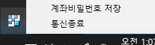

## 개발 환경 구축
* 키움 Open API+는 OCX(Object Linking and Embedding Custom Control) 방식을 사용
* 파이썬의 PyQt 패키지 사용
* 키움증권 계좌 가입 
* OpenAPI 설치 필요
  * https://www3.kiwoom.com/nkw.templateFrameSet.do?m=m1408000000

## PyQt 학습

## 문제 해결
### open api를 찾을 수 없다고 나올때
* open api를 사용하기 위해서는 32비트의 파이썬을 사용해야함
### 조회에 사용한 계좌비밀번호를 입력하십시오 에러 발생시 
* 윈도우 하단 아이콘 창에서 API 아이콘 우클릭 -> 계좌 비밀번호 저장
* 

## 참고 사이트 
* https://wikidocs.net/2872
